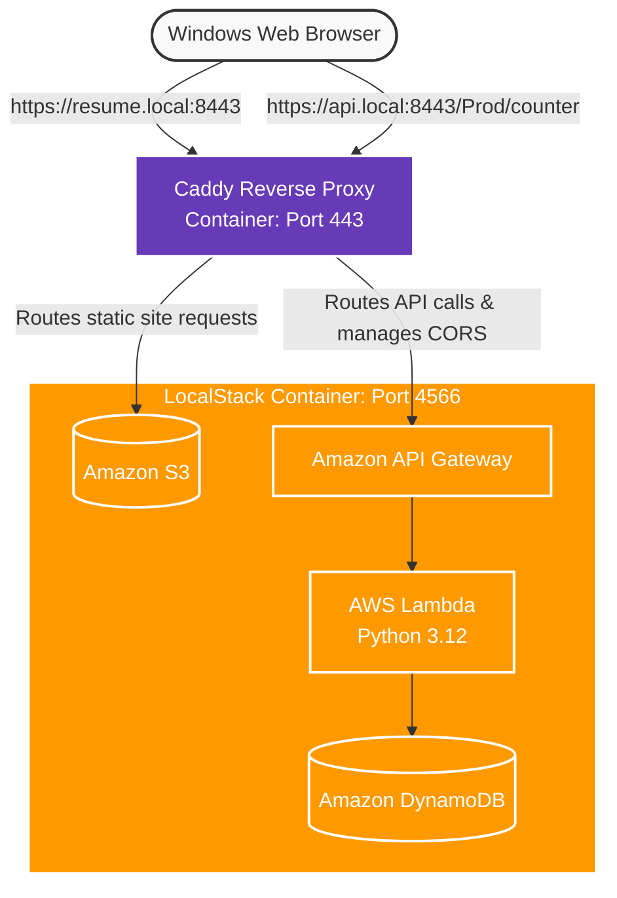

# AWS Cloud Resume Challenge — 100% Local Edition

This repository contains a fully functional, 100% local implementation of the **[AWS Cloud Resume Challenge](https://cloudresumechallenge.dev)**. By leveraging **LocalStack**, **Caddy**, **Terraform**, and **AWS SAM**, this project replicates the complete cloud infrastructure stack on a local Windows development machine using containerized AWS emulators and automated orchestration scripts.

---

## Local Architecture Blueprint


---

### 🛠️ The Tech Stack Transformation

| Cloud Component | Local Emulator Replacement | Purpose / Implementation |
| :--- | :--- | :--- |
| **Amazon S3** | `LocalStack S3 Engine` | Houses static HTML/CSS/JS web layout assets. |
| **Amazon CloudFront** | `Caddy Reverse Proxy` | Handles local domain HTTPS handshakes over port `8443`. |
| **Amazon Route 53** | `Windows hosts File` | Maps loopback domains (`resume.local`, `api.local`) to `127.0.0.1`. |
| **AWS API Gateway** | `LocalStack API Engine` | Manages the REST endpoint route handling (`/Prod/counter`). |
| **AWS Lambda** | `LocalStack Serverless Lambda` | Computes back-end view calculation logic via Python 3.12. |
| **Amazon DynamoDB** | `LocalStack Persistent NoSQL` | Stores the view tracking record securely on a persistent volume. |

---

### 🚀 Setup & Execution Manual

#### 1. Technical Prerequisites
Ensure your local machine has the following tools installed and accessible via your path environment variables:
*   [Docker Desktop](https://docker.com) (WSL2 Backend recommended)
*   [LocalStack CLI (`lstk`)](https://localstack.cloud) with an active Hobby/Community token key
*   [HashiCorp Terraform CLI](https://hashicorp.com)
*   [AWS SAM CLI](https://amazon.com) along with `pip install aws-sam-cli-local`
*   Python 3.12+ (Installed globally)

#### 2. Local DNS Setup
You must map your local loopback address to the customized subdomains. Run your Windows Notepad instance as **Administrator**, open `C:\Windows\System32\drivers\etc\hosts`, and append these rules to the bottom:
```text
127.0.0.1   resume.local
127.0.0.1   api.local
```

#### 3. Environment Variables
Create a file named `.env` in the root directory of your project folder. Populate it with your active LocalStack parameters:
```text
LOCALSTACK_API_ID=your_deployed_api_gateway_id
```
You can obtain the value by running this command: lstk aws apigateway get-rest-apis

---

## 🚀 Key Architectural Insights & Lessons Learned

During the execution of this challenge, several critical local cloud architecture challenges were solved:

### 1. Hybrid IaC Separation (Terraform + AWS SAM)
Rather than relying on a single IaC tool, we adopted a production-grade strategy:
* **Terraform (`tflocal`)** was selected to declare persistent, global frontend storage blocks, etc.
* **AWS SAM (`samlocal`)** was utilized for backend microservice definition, allowing rapid packaging, local serverless database provisioning (DynamoDB SimpleTable schemas).

### 2. Multi-Container Networking & TLS Handshakes
Simulating CloudFront & Route 53 required standing up **Caddy** alongside LocalStack:
* **Host Resolution:** Mapped `resume.local` and `api.local` in `C:\Windows\System32\drivers\etc\hosts` to point to `127.0.0.1`.
* **Internal Docker Routing:** Configured Caddy to proxy requests internally to LocalStack's container hostname (`http://localstack:4566`) rather than `localhost`.
* **CORS Harmonization:** API responses from LocalStack were configured to explicitly return `Access-Control-Allow-Origin: https://resume.local` headers, eliminating cross-domain browser blocks.

### 3. Portable Automation with GNU Makefile
To solve OS-specific path issues and CLI complexity, a dynamic `Makefile` was created to encapsulate all lifecycle operations:
* Automatically detects the operating system (Windows/Linux/macOS) to resolve shell builtins.
* Chains infrastructure provisioning, S3 static site synchronization, Lambda packaging, and test runs into single atomic commands.

---

## Accomplishments Summary
* Frontend: Hosted an HTML/CSS/JS site natively inside an emulated S3 Static Website Bucket.
* Infrastructure as Code: Successfully separated global layers using Terraform for global storage blocks and AWS SAM for microservice execution stacks.
* Advanced Script Automation: Optimized a portable, dynamic macro Makefile using GNU loops to resolve platform batch environments on the fly.
* Backend & Compute: Programmed an asynchronous Python Lambda function communicating with a persistent DynamoDB partition table to handle data increments.
* API Management: Stood up an explicit serverless REST API Gateway instance linked to secure cross-origin permissions (CORS).
* Networking CDN Simulation: Constructed an isolated Docker container loop with a Caddy Reverse Proxy handling custom subdomains, environmental parameter bindings, and dynamic SSL/TLS certificate handshakes.

---

### 🔒 Developer Security Note
Because Caddy manages secure connections (`https://`) using custom self-signed internal certificates, your web browser will trigger an untrusted connection warning upon your first visit. Bypassing this establishes local developer security credentials:
1. Open your browser and navigate to `https://resume.local:8443` -> Click **Advanced -> Proceed (unsafe)**.
2. Open a separate tab and navigate to `https://api.local:8443/Prod/counter` -> Click **Advanced -> Proceed (unsafe)**.
3. Refresh your primary resume page with **`Ctrl + F5`** to observe your synchronized live database views count.