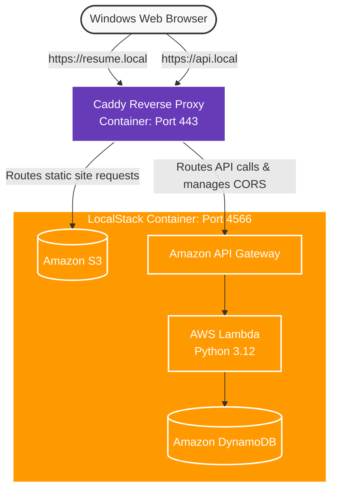

# AWS Cloud Resume Challenge — 100% Local Edition

This repository contains a fully local implementation of the **AWS Cloud Resume Challenge**. By leveraging **LocalStack**, **Caddy**, and **Terraform**, this project completely eliminates the need for a live AWS account, an internet domain purchase, or a credit card, while preserving the core architectural principles of the challenge.

---

## 🗺️ Architectural Mapping: Cloud vs. Local

We simulate every multi-tier cloud component right on a Windows machine inside a unified **Docker Desktop** network:

| Challenge Step | Production AWS Service | Local Emulation Equivalent |
| :--- | :--- | :--- |
| **04. Static Website** | Amazon S3 (Public Bucket) | **LocalStack S3 Engine** (`awslocal s3`) |
| **05. HTTPS** | Amazon CloudFront (CDN + SSL) | **Caddy Server** (Reverse Proxy + Auto TLS) |
| **06. DNS** | Amazon Route 53 (Custom Domain) | **Windows Hosts File** (`resume.local` mapping) |
| **08. Database** | Amazon DynamoDB Table | **LocalStack DynamoDB Engine** |
| **09. API** | AWS API Gateway (REST API) | **LocalStack API Gateway Engine** |
| **10. Python** | AWS Lambda (Python runtime) | **LocalStack Lambda Hot-Reloading** |
| **12. IaC** | Terraform (AWS Cloud Provider) | **Terraform with `tflocal` Wrapper** |
| **14 & 15. CI/CD** | GitHub Actions Cloud Runners | **GitHub Actions + Local Unit Testing** |

---

## 🛠️ Complete Technical Prerequisites

Before deploying the local cloud, ensure the following software stack is installed on the Windows machine:

### 1. Virtualization Engine
*   **Docker Desktop**: Crucial for hosting LocalStack and the Caddy container. Ensure **WSL 2 Integration** is enabled in your settings.
    *   *Verification Command:* `docker compose version`

### 2. Infrastructure as Code (IaC)
*   **Terraform CLI**: Used to programmatically declare and provision all mock cloud resources.
    *   *Verification Command:* `terraform -v`
*   **tflocal**: A lightweight python-based wrapper that intercepts standard Terraform commands and points them automatically to LocalStack (`http://localhost:4566`) instead of real AWS.
    *   *Installation:* `pip install terraform-local`

### 3. Backend, Scripting & Validation Tools
*   **Python (3.11 or 3.12)**: Required for writing the Lambda visitor counter code, unit testing, and utility tooling.
    *   *Verification Command:* `python --version`
*   **AWS CLI & awslocal**: The standard AWS command-line interface paired with LocalStack's automatic routing tool wrapper.
    *   *Installation:* `pip install awscli awscli-local`
    *   *Verification Command:* `awslocal --version`

### 4. Development Environment
*   **Visual Studio Code (VS Code)**: Recommended IDE.
    *   *Essential Extensions:* **HashiCorp Terraform**, **Python**, and **Docker**.

---

## 🚀 Phased Implementation Roadmap

We will build and debug this stack over four incremental milestones:

### 📑 Phase 1: Local Cloud Setup & Network Routing
*   Create a dual-container layout using `docker-compose.yml` to pair LocalStack and Caddy.
*   Edit the Windows `hosts` file to register local development domains (`resume.local`, `api.local`).
*   Establish Caddy's auto-generation of locally trusted SSL credentials.

### 🌐 Phase 2: Frontend Engineering & Static S3 Hosting
*   Draft the raw resume assets (`index.html`, `styles.css`).
*   Author the initial infrastructure block (`main.tf`) to instantiate an S3 bucket via `tflocal`.
*   Bind the Caddy server configuration to proxy port `443` directly back to the LocalStack S3 instance.

### ⚙️ Phase 3: Serverless Backend & Database Tracking
*   Write a stateless Python Lambda handler to atomically increment a target attribute value.
*   Write local Python `pytest` suites to safely validate the execution logic offline.
*   Provision a localized DynamoDB table and an API Gateway endpoint using Terraform scripts.

### 🔗 Phase 4: Full-Stack Integration & CORS Resolution
*   Write browser-native JavaScript (`fetch()`) inside `index.html` to load and parse counter payloads.
*   Configure the local API Gateway CORS headers via Terraform to whitelist the `resume.local` domain.
*   Verify the fully functional end-to-end loop securely over local HTTPS.
*   

---

## Solution Architecture Diagram
